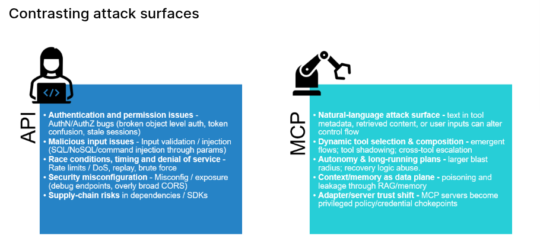

#### Vulnerabilities we will cover

1 Prompt injection
1 Preference atatcks
1 Privilege escalation
Memory poisoning 
Tool misuse

##### MCP TOP 10

- Token mismanagement
- Privilege escalation via scope creep
- Tool poisoning
- Software supply chain attacks 
- Command injection
- Prompt injection
- Insufficient Authentication & Authorization
- Lack of Audit and Telemetry
- Shadow MCP Servers
- Context injection & over-sharing

#### Vocabulary

System Prompt = The persistent instruction set that defines the agent's role, limits and behaviour, typically stars with "you are ..", strong separation between system and user

Planning & Reasoning Loop = The mechanism that lets an agent: break a goal into steps, decided which actions to take, observer results, adjust the plan
This is what turns the chatbot into an agent that can act autonomously

#### Images

 
